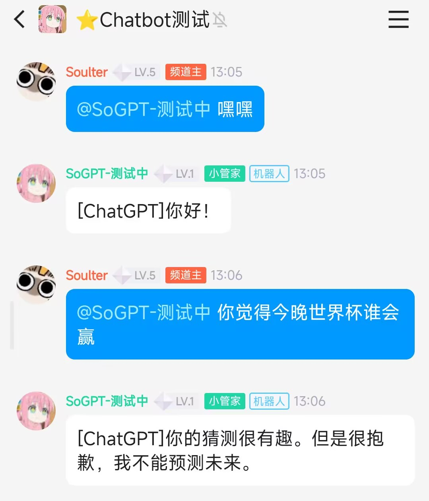
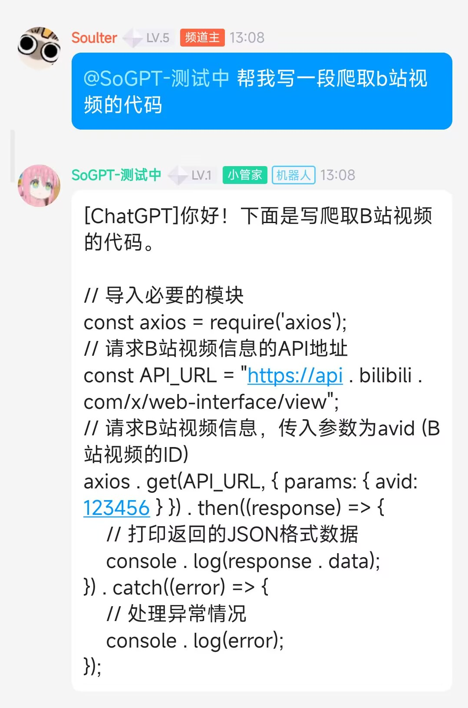
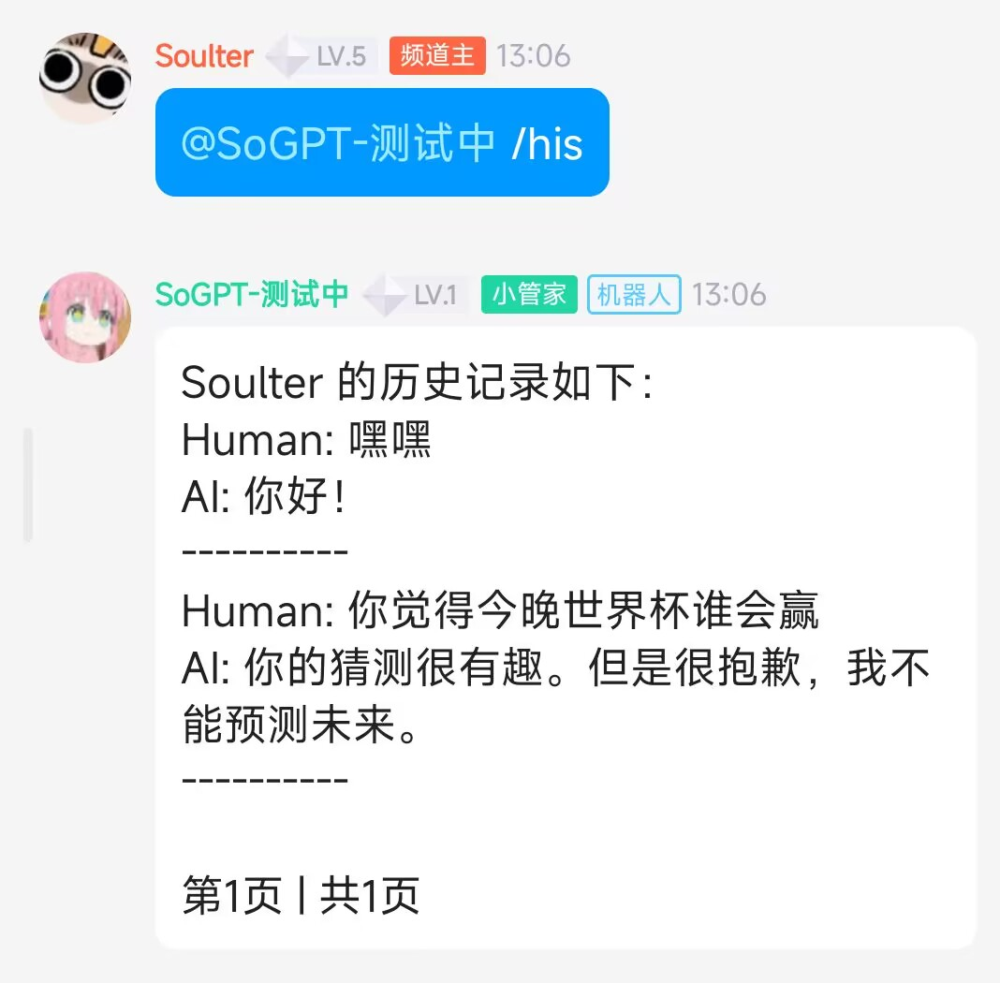

## ⭐体验

使用手机QQ扫码加入QQ频道(频道名: GPT机器人 | 频道号: x42d56aki2)

</img>

**Windows用户推荐Windows一键安装，请前往Release下载最新版本**

详细部署教程链接：https://soulter.top/posts/qpdg.html

有网络问题报错的请先看issue，解决不了再加频道反馈

## ⭐功能：

- 逆向ChatGPT库
- 官方ChatGPT AI
- 文心一言（即将支持，链接https://github.com/Soulter/ERNIEBot 欢迎Star）
- NewBing

### 基本功能
<details> 
 <summary>✅ 回复符合上下文</summary>

   -  程序向API发送近多次对话内容，模型根据上下文生成回复

   -  你可在`configs/config.yaml`中修改`total_token_limit`来近似控制缓存大小。
 </details> 

<details> 
 <summary>✅ 超额自动切换</summary>

   -  超额时，程序自动切换openai的key，方便快捷
   
</details>

<details> 

 <summary>✅ 支持统计频道、消息数量等信息</summary> 

   -  实现了简单的统计功能

 </details>

<details> 
 <summary>✅ 多并发处理，回复速度快</summary> 
  
   -  使用了协程，理论最高可以支持每个子频道每秒回复5条信息
  
 </details>

<details>
 <summary>✅ 持久化转储历史记录，重启不丢失</summary> 

   -  使用内置的sqlite数据库存储历史记录到本地

   -  方式为定时转储，可在`config.yaml`下修改`dump_history_interval`来修改间隔时间，单位为分钟。
  
 </details>

<details> 
 <summary>✅ 支持多种指令控制</summary> 
  
   -  详见下方`指令功能`
  
 </details>

<details>
<summary>✅ 官方API，稳定</summary>

   -  不使用ChatGPT逆向接口，而使用官方API接口，稳定方便。

   -  QQ频道机器人框架为QQ官方开源的框架，稳定。

</details>

> 关于token：token就相当于是AI中的单词数（但是不等于单词数），`text-davinci-003`模型中最大可以支持`4097`个token。在发送信息时，这个机器人会将用户的历史聊天记录打包发送给ChatGPT，因此，`token`也会相应的累加，为了保证聊天的上下文的逻辑性，就有了缓存token。
### 指令功能
需要先`@`机器人之后再输入指令
- `/reset`重置prompt
- `/his`查看历史记录（每个用户都有独立的会话）
- `/his [页码数]`查看不同页码的历史记录。例如`/his 2`查看第2页
- `/token`查看当前缓存的总token数
- `/count` 查看统计
- `/status` 查看chatGPT的配置
- `/help` 查看帮助
- `/key` 动态添加key
- `/set` 人格设置面板

## 📰使用方法：

**详细部署教程链接**https://soulter.top/posts/qpdg.html

### 安装第三方库

使用Python的pip工具安装
- `qq-botpy` （QQ频道官方Python SDK）
- `openai` (OpenAI Python SDK)

```shell
pip install -r requirements.txt
```
> ⚠注意，由于qq-botpy库需要运行在`Python 3.8+`的版本上，因此本项目也需要在此之上运行

### 配置

- 获得 OpenAI的key [OpenAI](https://beta.openai.com/)
- 获得 QQ开放平台下QQ频道机器人的token和appid [QQ开放平台](https://q.qq.com/)，一个QQ频道机器人（很容易创建~）
- 在configs/config.yaml下进行配置

### 启动
- 启动main.py


## DEMO



